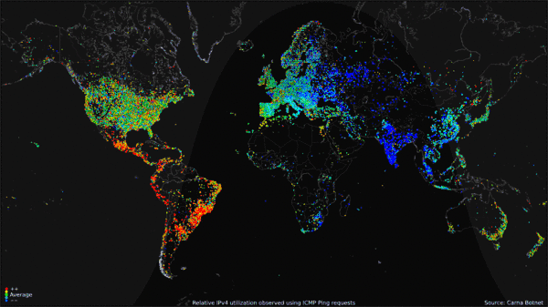

# 🚨 Siber saldırı alanları

<figure><figcaption>
World map of 24-hour relative average utilization of IPv4 addresses observed using <a href="https://en.wikipedia.org/wiki/Ping_(networking_utility)">ICMP ping</a> requests by Carna botnet, June - October 2012
</figcaption></figure>


Karspersky Lab Güvenlik firması tarafından yayınlanan gerçek zamanlı siber atak haritası

